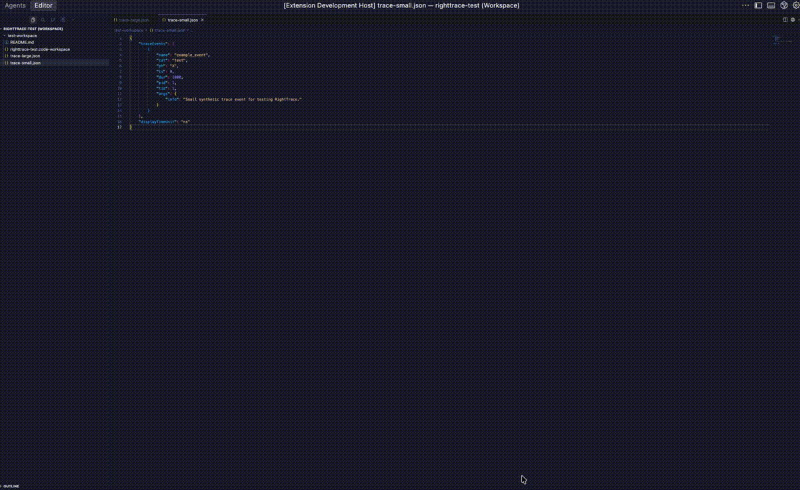

<h1 align="center">🧭 RightTrace 🧭</h1>

<p align="center">
  <a href="https://github.com/maawad/RightTrace/actions/workflows/ci.yml">
    
  </a>
  <a href="https://github.com/maawad/RightTrace/actions/workflows/publish.yml">
    
  </a>
  <a href="https://open-vsx.org/extension/TinkerCode/rightrace">
    
  </a>
</p>

<p align="center">
  
</p>

<p align="center">
  <strong>Right-click a trace file and open it directly in the Perfetto UI inside VS Code / Cursor.</strong>
</p>

## 🎥 Demo

<p align="center">
  
</p>

## 📦 Installation

### Download Latest Version

[](https://github.com/maawad/RightTrace/actions/workflows/publish.yml)

1. Go to the [Actions](https://github.com/maawad/RightTrace/actions) tab.
2. Click on the latest successful **Publish** workflow run.
3. Scroll to **Artifacts** and download the `rightrace-vsix` artifact.
4. Extract the `.vsix` file from the zip.
5. In VS Code / Cursor: `Extensions` → `...` → **Install from VSIX**.
6. Select the downloaded `.vsix` file.

### From Open VSX

[](https://open-vsx.org/extension/TinkerCode/rightrace)

Visit [Open VSX](https://open-vsx.org/extension/TinkerCode/rightrace) to install the extension or download the `.vsix`.

## 🚀 Quick Start

1. Open a folder containing Perfetto/Chrome-style trace files (e.g. `.pftrace`, `.json`).
2. In the Explorer, right-click a trace file.
3. Choose **RightTrace: Open in Perfetto UI**.
4. A new editor panel opens with `https://ui.perfetto.dev` and automatically loads your trace using Perfetto’s `open_trace_in_ui` flow.

## ✨ Features

- **Right-click to open**: Instantly open trace files from the Explorer.
- **In-editor Perfetto**: Uses the official Perfetto UI inside a VS Code webview.
- **Auto-load trace**: Mirrors `tools/open_trace_in_ui.py` so your trace is loaded automatically—no manual file picker step.
- **Configurable Perfetto origin**: Point at custom Perfetto instances via settings.

## ⚙️ Configuration

You can configure the Perfetto UI origin in settings:

```json
{
  "rightrace.perfettoUrl": "https://ui.perfetto.dev/"
}
```

## 🔧 Development

```bash
npm install
npm run compile
```

Press `F5` in VS Code / Cursor and use the **Run RightTrace Extension** launch config.
The included `test-workspace/` folder contains small sample traces for debugging.

## 📝 License

MIT License - see [LICENSE](LICENSE) for details.

# RightTrace
